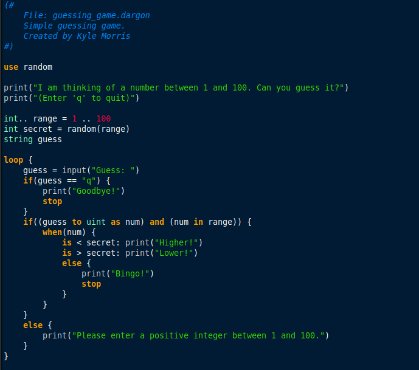

# The Dargon Programming Language - v0.1


Dargon is a small passion project and toy language with a focus on being:

- Fun
- Artistic and "always experimental"
- Free and open-source (FOSS)

Dargon is currently not aiming to be:

- The next general-purpose programming language
- Built for speed or critical applications

The full Dargon experience aims to deliver the following:

- The portable Dargon Interpreter (DIR)
- Syntax highlighting for popular text editors (Vim, Notepad++, etc.)
- Full, local documentation that is always available
- A basic text editor GUI, built specifically for Dargon

## Where to Start

**Dargon is not ready for any form of distribution or usage. It's still large work-in-progress.** There is some initial documentation, including a tutorial on how I think Dargon should perform (almost like a requirements document), and grammar definition. These can be found in the [doc](doc) directory of this repository. Some [example](examples) programs are also available for preview. 

Dargon is currently using the CMake build system:

```bash
repo$ pwd
my/path/to/dargon/repo
repo/build$ mkdir build && cd build
repo/build$ cmake ..
repo/build$ cmake --build .
```

## Repository Layout

- [doc](doc): Documentation lives here.

- [examples](examples): Some example Dargon files which will be used as the basis for end-to-end testing. It also includes the files from the [tutorial](examples/tutorial).

- [proj](proj): This contains the Code::Blocks project I am using.

- [src](src): The source code, split up into different sections. It has its own [readme](src/README.md).

## Basic Code Example



*Opened with xed, using custom sytax highlighting (see [here](res/text_highlighting))*

## Technology Used

- CMake (verison 3.22.1)
- g++ (using C++17)
- Code::Blocks IDE (version 20.03)
- doxygen (for auto-documentation)
- MarkText (for documentation)
