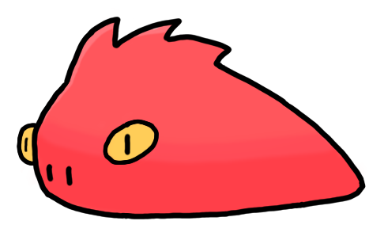

# The Dargon Programming Language




Dargon is a small passion project and toy language with a focus on being:

- Fun
- Artistic and "always experimental"
- Free and open-source (FOSS)

Dargon is currently not aiming to be:

- The next general-purpose programming language
- Built for speed or critical applications

## Where to Start

**Dargon is still largely in the design phase.** 

You can view the current documentation, including an in-progress tutorial, being hosted [on the official homepage](https://kylemmorris.github.io/dargon-lang-homepage).

## Building from Source

Dargon is currently using the CMake build system:

```bash
repo$ pwd
my/path/to/dargon/repo
repo$ mkdir build && cd build
repo/build$ cmake ..
repo/build$ cmake --build .
```

## Basic Code Example


